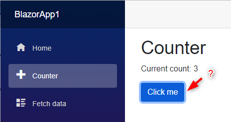

# Blazor

Documentation for Blazor tech

## References

- [DotNET Microsoft Balzor](https://dotnet.microsoft.com/en-us/apps/aspnet/web-apps/blazor)

## Documentation

- [Radzen](./Radzen)

## Strange Things

Can't say if it' a bug or else :

The state of the clicked button never comes bac to unclicked :worried:

    

