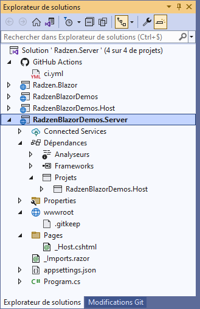

# Radzen

I'm so surprise to dicover that in few clics I can run radzen site on my local machine with all source code that I would like to discover this professional Balzor application.

I just had to add the project RadzenBlazorDemos.Host.csproj in the solution that was missing ... ?



## References

- [GitHub - radzen-blazor](https://github.com/radzenhq/radzen-blazor)

### What do we have while downloading radzen-blazor

For exemple in file :

radzenhq/radzen-blazor/blob/master/RadzenBlazorDemos.Server/Program.cs

```csharp
// Demo services
builder.Services.AddScoped<ThemeService>();
builder.Services.AddScoped<CompilerService>();
builder.Services.AddScoped<ExampleService>();
```

You have the special ThemeService ...

---

[Home](../../) > [Blazor](../) > Radzen
