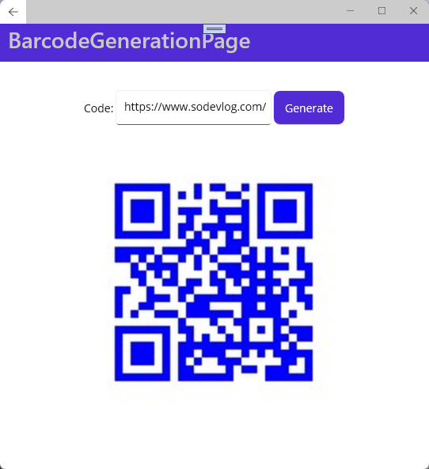
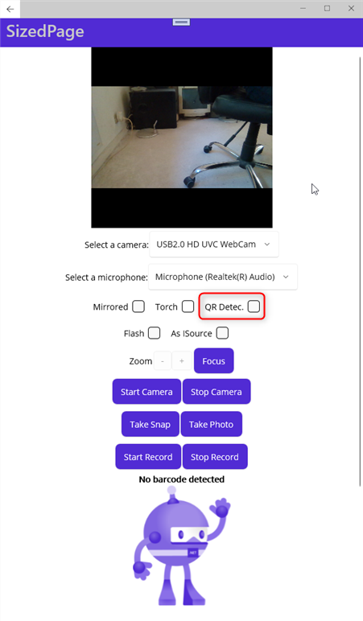

# MAUI .NET Multi-platform App UI

MAUI is a technologie that I like because it opens me the doors of the development on mobile's plateformes. 

I've always tried to avoid developing in JavaScript. When I was very young, I was already doing ASPX with the AjaxControlToolkit, no-JavaScript!

## MauiAppToolkit

[MauiAppToolkit](https://github.com/mabyre/MauiAppToolkit)

## Camera.MAUI

Package for drinving camera on MAUI.

[Camera.MAUI](https://github.com/hjam40/Camera.MAUI)

Thanks to the pluggging Camera.MAUI this is the QR Core:

Features you have access to thanks to Camera.MAUI

QR Code features are great

