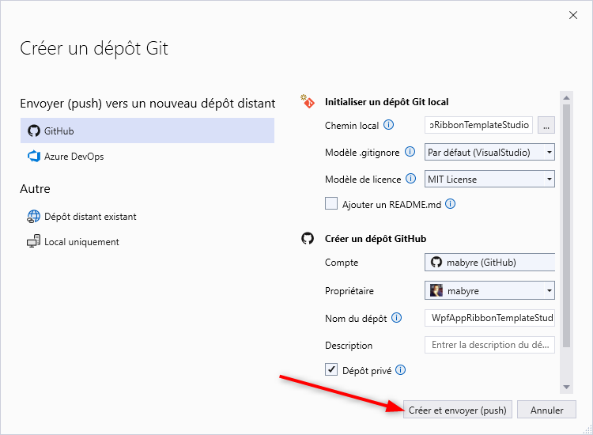

[Home](https://github.com/mabyre/docs)

# Visual Studio Documentation

Sur the aim is not to make an exhaustive documentation of Visual Studio this is not for a human being. The aim is tho atake some very small documentation of what I found in Visual Studio

## GitHub in Visual Studio

I found it's not easy to first create repo in GitHub then to use this created repo into Visual Studio. What I found is to create github repo directly in Visual Studio :

## Discovering Visual Studio

How To configure Visual Studio Community :

[C#.NET Blog - Visual Studio 2022 Community](https://csharp-dotnet.sodevlog.com/2023/01/visual-studio-2022-community.html)
